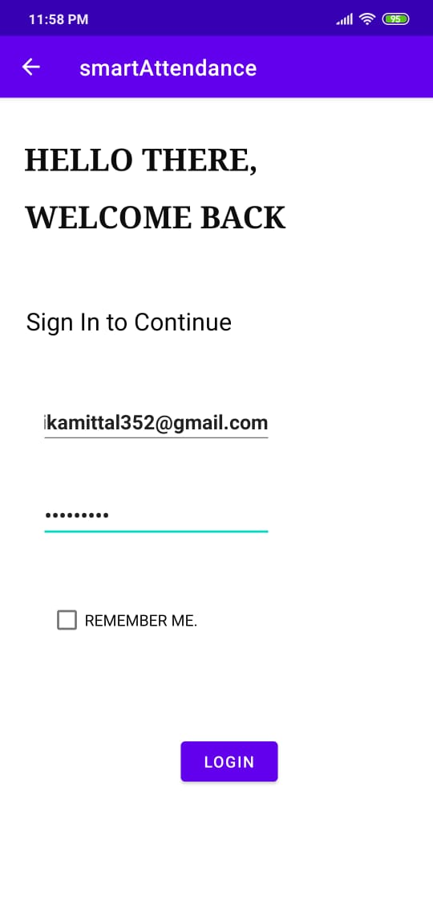
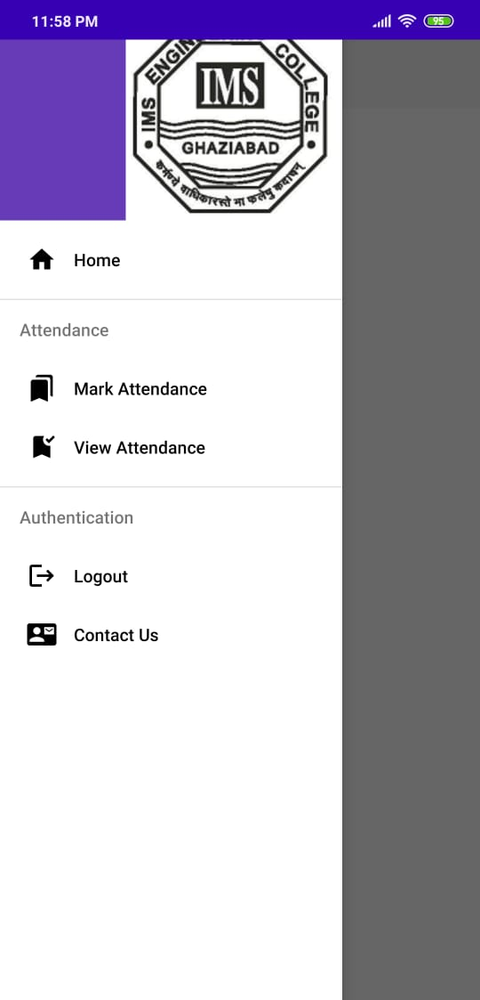

# SmartAttendanceApp
So this is how the first page of the prject looks like which has two modules faculty and admin

Moving forward by clicking on faculty button here we are on the sign in page.

By adding the correct credentials you can move forwar to the welcome page which has several options in the navihation drawer.

Now by selcting the mark attendance option It follows the next screen which has the options to select the required data that is year, branch, class and subject for which you need t mark the specific attendance
Then, followed by the main functionality of the project that is the swipe cards
It will contain the names of all the respective students as selected by you as per the year,branch and class.
Now you can swipe the cards. If you want to mark present swipe right and if you want to mark absent swipe left or you can do so by clicking the buttons also.
As per the demonstration given below.

